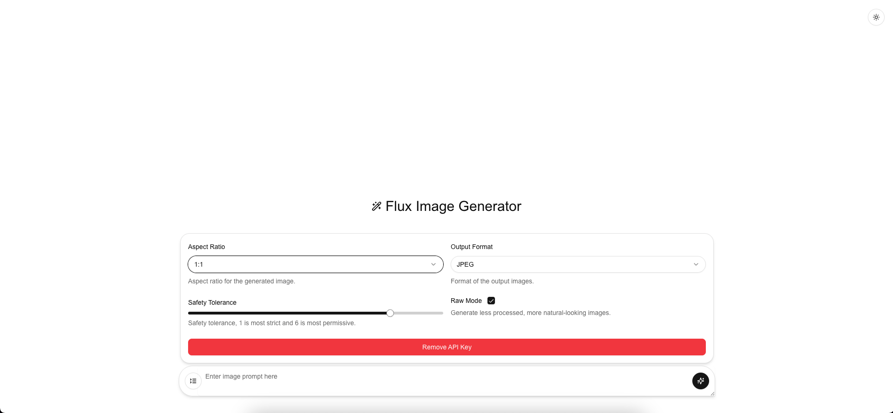

# Flux Image Generator



## Generate amazing images from text prompts

Flux Image Generator is a web application built with Next.js that allows you to create stunning images from text prompts. Harnessing the power of AI image generation, this tool provides a user-friendly interface to bring your creative visions to life.

**[Try it out!](http://localhost:3000)** (Once you run the development server)

## ✨ Features

- **Text-to-Image Generation:** Simply enter a text prompt and let Flux Image Generator create a unique image based on your description.
- **Aspect Ratio Control:** Customize the shape of your generated images with a variety of aspect ratios to choose from (21:9, 16:9, 3:2, 4:3, 5:4, 1:1, 4:5, 3:4, 2:3, 9:16, 9:21).
- **Output Format Selection:** Choose between `PNG` for lossless quality or `JPEG` for smaller file sizes.
- **Safety Tolerance Adjustment:** Control the level of content filtering with the safety tolerance slider, from strict to permissive.
- **Raw Mode:** Generate less processed, more natural-looking images with the raw mode option.
- **API Key Management:** Securely manage your API key to access the image generation features.
- **Dark/Light Mode:** Enjoy a comfortable viewing experience with built-in dark and light mode toggling.
- **Responsive Design:** Use Flux Image Generator seamlessly on desktops, tablets, and mobile devices.

## 🚀 Getting Started

Follow these simple steps to get Flux Image Generator up and running on your local machine.

### Prerequisites

- [Node.js](https://nodejs.org/) (version 18.x or later)
- [npm](https://www.npmjs.com/) or [yarn](https://yarnpkg.com/) or [pnpm](https://pnpm.io/) or [bun](https://bun.sh/) package manager

### Installation

1.  Clone the repository:

    ```bash
    git clone <repository-url>
    cd fal-flux-generation-main
    ```

2.  Install dependencies using your preferred package manager:

    ```bash
    npm install
    # or
    yarn install
    # or
    pnpm install
    # or
    bun install
    ```

### Development Server

Run the development server to preview the application in your browser:

```bash
npm run dev
# or
yarn dev
# or
pnpm dev
# or
bun dev
```

Open [http://localhost:3000](http://localhost:3000) in your browser to view the Flux Image Generator.

## 📚 Learn More

Explore the following resources to deepen your understanding of Next.js and related technologies:

- **[Next.js Documentation](https://nextjs.org/docs)**: Dive into the official Next.js documentation to learn about its features and API.
- **[Learn Next.js](https://nextjs.org/learn)**: Take an interactive Next.js tutorial for a hands-on learning experience.
- **[Next.js GitHub Repository](https://github.com/vercel/next.js)**: Contribute to or explore the Next.js codebase on GitHub.
- **[shadcn/ui](https://ui.shadcn.com/)**: Learn more about the UI library used in this project.
- **[Tailwind CSS Documentation](https://tailwindcss.com/docs)**: Master the utility-first CSS framework used for styling.

## 📦 Technologies Used

- [Next.js](https://nextjs.org/)
- [React](https://reactjs.org/)
- [TypeScript](https://www.typescriptlang.org/)
- [Tailwind CSS](https://tailwindcss.com/)
- [shadcn/ui](https://ui.shadcn.com/)
- [Geist Fonts](https://vercel.com/font)
- [lucide-react](https://lucide.dev/)
- [react-hot-toast](https://react-hot-toast.com/)

## 🚀 Deploy to Vercel

Deploy your Flux Image Generator app effortlessly to the cloud with [Vercel](https://vercel.com/), the platform created by the developers of Next.js.

[](https://vercel.com/new?utm_medium=default-template&filter=next.js&utm_source=create-next-app&utm_campaign=create-next-app-readme)

Refer to the [Next.js deployment documentation](https://nextjs.org/docs/app/building-your-application/deploying) for detailed instructions.

## 🤝 Contributing

Contributions are welcome! If you have ideas for improvements or new features, feel free to open an issue or submit a pull request.

## 📄 License

[MIT](LICENSE) (If applicable, add license details or link to LICENSE file)
